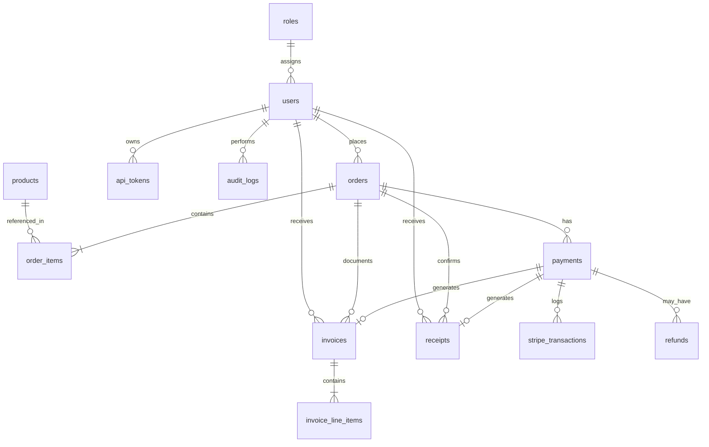

# Commerce Portal

CodeIgniter 3 commerce portal with admin management, customer checkout via Stripe, invoice and receipt generation, optional receipt email with PDF attachment, and a bearer-token REST API.

**Stack:** PHP 7.3 (PHP-FPM) · CodeIgniter 3 · MySQL 8 · Docker Compose (Nginx + PHP-FPM + MySQL) · Bootstrap 5 · AdminLTE 4 · Stripe Checkout · Dompdf

---

## 1. Installing and testing

### Prerequisites

- Docker Desktop (or Docker Engine + Compose)
- Stripe account in **test mode** and [Stripe CLI](https://stripe.com/docs/stripe-cli) for local webhooks
- (Optional) [Postman](https://www.postman.com/) — collection at `docs/Commerce_Portal_API.postman_collection.json`
- (Optional) [Mailtrap](https://mailtrap.io/) — only if testing receipt email

### Install

```bash
# 1. Enter the project directory
cd project

# 2. Create environment file
cp .env.example .env
```

Edit `.env` and set at least:

```env
APP_ENV=development
APP_URL=http://localhost:8080

# Database values can stay as in .env.example for Docker

STRIPE_PUBLIC_KEY=pk_test_...
STRIPE_SECRET_KEY=sk_test_...
STRIPE_WEBHOOK_SECRET=whsec_...   # from Stripe CLI (see below)

# Optional — receipt email
MAIL_ENABLED=true
MAIL_HOST=sandbox.smtp.mailtrap.io
MAIL_PORT=2525
MAIL_USER=...
MAIL_PASS=...
```

```bash
# 3. Start containers
docker compose up -d --build

# 4. Install PHP dependencies (Stripe SDK + Dompdf)
#    composer.json and composer.lock are committed; vendor/ is gitignored.
#    Use composer install — do not re-run composer require.
docker compose exec php composer install

# 5. Run database migrations and seed data
docker compose exec php php public/index.php cli/migrate
```

Application URL: **http://localhost:8080**

### Seed accounts

| Role     | Email                  | Password      |
|----------|------------------------|---------------|
| Admin    | `admin@example.com`    | `password123` |
| Customer | `customer@example.com` | `password123` |

### Stripe webhook (local)

Stripe cannot reach `localhost` directly. Forward events with Stripe CLI on the **host machine** (not inside Docker):

```bash
stripe listen --forward-to localhost:8080/webhooks/stripe
```

Copy the printed `whsec_...` value into `.env` as `STRIPE_WEBHOOK_SECRET`, then:

```bash
docker compose restart php
```

**Ngrok** is an alternative if you prefer a public URL registered in the Stripe Dashboard instead of the CLI.

> I also reconcile Checkout Session status on the payment success page when the webhook is delayed. Prefer the webhook path for production-like behaviour.

### Manual test plan

1. **Admin** — log in → create/edit users and products → review dashboard and document lists.
2. **Customer** — log in → browse products → cart → checkout → place order → Pay with Stripe.
3. **Test card:** `4242 4242 4242 4242`, any future expiry, any CVC.
4. Confirm redirects:
   - **Success** → return to the portal with the order marked paid
   - **Cancel / unsuccessful** → return to the portal without marking the order paid
5. Confirm invoice and receipt are created and visible under **User → Invoices / Receipts**.
6. **Admin** — view all invoices, receipts, and the Stripe transaction log.
7. **Ownership** — a customer must not see another customer’s documents (expect HTTP 404).
8. **API** — import the Postman collection → run **Auth → Login** (bearer token is saved automatically) → **List Invoices** / **List Receipts**.
9. **(Optional)** With Mailtrap configured, confirm the HTML receipt email and PDF attachment after payment.

### API quick test (curl)

```bash
# Login
curl -s -X POST http://localhost:8080/api/v1/login \
  -d "email=customer@example.com&password=password123"

# Use the returned data.token
curl -s -H "Authorization: Bearer <TOKEN>" \
  "http://localhost:8080/api/v1/invoices?page=1&per_page=10"

curl -s -H "Authorization: Bearer <TOKEN>" \
  "http://localhost:8080/api/v1/receipts?page=1&per_page=10"
```

| Method | Endpoint | Auth | Notes |
|--------|----------|------|-------|
| `POST` | `/api/v1/login` | Public | |
| `GET`  | `/api/v1/invoices` | Bearer | `?page=` / `?per_page=` (default 10, max 100) |
| `GET`  | `/api/v1/invoices/{id}` | Bearer | Owner-scoped |
| `GET`  | `/api/v1/receipts` | Bearer | `?page=` / `?per_page=` (default 10, max 100) |
| `GET`  | `/api/v1/receipts/{id}` | Bearer | Owner-scoped |

List responses return `{ items, page, per_page, total, total_pages }` inside `data`.

### Pagination

Shared helper: `application/helpers/pagination_helper.php` (`pagination_prepare` / `pagination_result`). UI lists use `?page=`; the API also accepts `per_page`.

| Area | Lists |
|------|--------|
| Store | Products catalog, customer invoices, receipts, orders |
| Admin | Users, products, invoices, receipts, orders, Stripe transactions, audit logs |
| API | `GET /api/v1/invoices`, `GET /api/v1/receipts` |

---

## 2. ER diagram

Detailed design notes are in [`docs/database-design.md`](docs/database-design.md). Core relationships:



**Design highlights**

- Price and product name snapshots on `order_items` and `invoice_line_items` (immutable after purchase).
- One invoice and one receipt per paid payment (`UNIQUE(payment_id)`).
- Stripe webhook idempotency via `stripe_transactions.stripe_event_id` (UNIQUE).
- Soft delete on `users` and `products`.
- API tokens store **SHA-256 hashes only** (`api_tokens.token_hash`); the raw bearer token is never persisted.

---

## 3. How I would further tighten what users can do

Today the app already blocks the obvious gaps:

- **Route level** — `Auth_middleware` + `config/auth.php` (session + role for `admin/` / `user/`, bearer for `api/`)
- **Role level** — admin vs customer; wrong role is redirected away
- **Record level** — invoices/receipts are loaded with `user_id` filters; another user’s document returns **404** (not 403), so we don’t leak that the record exists
- **API** — hashed bearer tokens in `api_tokens`; no reliance on browser session cookies

If I continued this system, I would push authorization further in a few practical ways:

1. **Finer permissions** — not only `admin` / `customer`, but capabilities like `products.manage` or `invoices.read_all`, so a future “support staff” role does not need a new middleware rewrite.
2. **One policy place** — keep “can this user touch this invoice?” in a small service/policy layer so every controller does not re-implement the same check.
3. **Harder sessions & tokens** — idle timeout, regenerate session on login/role change, shorter API token TTL, named tokens with revoke, and refresh tokens if mobile becomes real traffic.
4. **Rate limits + MFA for admins** — slow down brute-force on `/login` and `/api/v1/login`; add TOTP for admin before go-live.
5. **Broader audit** — today `payment.completed` is audited; I would also log admin user/product changes, failed logins, and token revoke events.

Hiding a menu item is never enough. Every write/read path has to re-check role and ownership on the server.

### Further product and engineering enhancements

Separately, if I continued this system based on business and engineering needs, I would also consider:

**Catalog & inventory**

- **Stock management** — add `stock_qty`, admin stock adjustments, and check/decrement inside the order transaction so checkout cannot oversell.
- **SKU auto-generation** — generate unique SKUs on product create (with an optional manual override) instead of relying only on admin-entered values.
- **Variants / sizes** — model size/color (or similar) as product variants with their own SKU/price/stock, rather than one flat product row.

**Payments lifecycle**

- **Refunds** — the `refunds` table already exists; I would wire Stripe refunds, update payment/order status, and add an admin refund path so the payment lifecycle is complete.

**Engineering**

- **Automated testing** — PHPUnit (or Codeception) around services such as orders, payments, ownership checks, and API auth.
- **Contracts & repositories** — introduce interfaces/contracts and a `BaseRepo` pattern so data access stays consistent, models stay thin, and persistence can evolve without rewriting controllers/services.
- **API transformers / resources** — extract `formatInvoice` / `formatReceipt` into dedicated transformer classes (Laravel Resource-style) as the API grows.

---

## 4. Mobile API on CodeIgniter 3 — what I would watch for

This project already has a small JSON API (`/api/v1/login`, invoices, receipts) with bearer auth, owner scoping, and shared helpers (`json_success` / `json_error`). One CI3 gotcha I hit: the API login controller is named `Login`, not `Auth`, because CI3 cannot load the `Auth` library when a controller is also named `Auth`.

For a real mobile app I would still treat this as a starting point, not the final platform.

**Things I would design for**

- Short-lived access tokens + refresh tokens (30-day static bearers are fine for a demo, not for phones in the wild)
- HTTPS only; keep `/api/v1` stable and add `/api/v2` for breaking changes
- Consistent error codes the app can switch on (list pagination is already in place — see §1)
- Idempotency keys around payment-related POSTs
- Move email/PDF off the request thread (queue + worker) so a slow SMTP provider does not freeze the mobile UX

**Honest CI3 / PHP 7.3 limits**

- PHP 7.3 is end-of-life — no security fixes; I would plan PHP 8.x + CI4 (or another API-focused framework) for a long-lived mobile backend
- CI3 is session/HTML-first; API middleware is hand-rolled hooks/config, not a first-class pipeline
- No built-in OpenAPI, queues, or Sanctum-style token package — Postman and custom token tables fill the gap here
- Fine for this assessment’s three endpoints; painful once you have dozens of mobile screens and background jobs

I would keep the same domain tables (orders, payments, invoices, receipts) even if the framework changed later.

---

## 5. Staging vs production deployment

I did not deploy this assessment to a public host. Locally it runs on Docker Compose. Below is how I would promote the same codebase.

### Simple path (what I would do first)

One VPS (or a small cloud VM), Docker Compose, Nginx TLS (Let’s Encrypt), MySQL on the same host or a managed DB, env vars from a secured `.env` (never committed).

```text
Internet → Nginx (HTTPS) → PHP-FPM (this app)
                         → MySQL
Stripe webhooks → https://your-domain/webhooks/stripe
```

Rough cost: about **$10–25/month** for a small VPS staging box.

### Staging vs production (same app, different config)

| | Staging | Production |
|---|---------|------------|
| Goal | QA with Stripe **test** keys | Real customers, Stripe **live** keys |
| `APP_ENV` | `testing` (or `development`) | `production` (hide PHP errors) |
| Data | Seed / disposable | Backed-up real data |
| Access | Password, VPN, or IP allowlist | Public + firewall / WAF if needed |
| Release | Deploy from `main` freely | Tag a release, migrate, then switch traffic |

Deploy steps I would follow every time:

1. Build/pull the image; run `composer install --no-dev --optimize-autoloader`
2. Inject secrets (Stripe, DB, mail) from the environment — not from the image
3. Run `php public/index.php cli/migrate` before opening the new version
4. Point Stripe’s webhook to the public HTTPS URL and verify signatures (same code path as local CLI forwarding)
5. Take DB backups before migrate; confirm payment and audit tables restore cleanly

### If traffic grew (cloud sketch)

```text
Users → CDN/WAF → Load balancer → App (PHP-FPM × N)
                                 → Managed MySQL
                                 → Object storage (PDFs) + worker (email)
Stripe → HTTPS /webhooks/stripe
```

Ballpark AWS-style cost if HA mattered: staging roughly **$50–100/month**, production roughly **$170–400/month** depending on Multi-AZ MySQL and size. For this portal’s expected load, I would stay on the simple VPS path until metrics said otherwise.

### Local reviewer note

`docker compose up --build` does not install PHP packages by itself. After start:

```bash
docker compose exec php composer install
docker compose exec php php public/index.php cli/migrate
```

Webhooks still use Stripe CLI or Ngrok on the host — no extra Docker service required.

---

## 6. Tools and libraries

### What I used

| Tool / library | Role |
|----------------|------|
| **Docker Compose** | Local environment: Nginx, PHP-FPM 7.3, MySQL 8 |
| **Composer** | Dependency management (`composer.lock` committed) |
| **stripe/stripe-php** | Checkout Sessions and webhook signature verification |
| **dompdf/dompdf** | Receipt PDF attachment for optional email |
| **Bootstrap 5 + AdminLTE 4** | Responsive admin and storefront UI |
| **Stripe CLI** | Local webhook forwarding |
| **Mailtrap** | Safe email sink in development |
| **Postman** | API collection with automatic bearer token capture |
| **Git** | Feature-branch workflow and tagged milestones |
| **GitHub Actions** | CI on `main` push/PR (`.github/workflows/ci.yml`): Composer install, PHP 7.3 syntax check over `application/`, `docker compose config` |
| **Mermaid** | ER diagram in documentation |

### What I would consider next

| Tool | Why |
|------|-----|
| PHPUnit / Codeception | Automated tests for services and API |
| Redis | Sessions, rate limits, queues |
| Queue workers (Supervisor + Redis/SQS) | Async email, PDF, and webhook processing |
| OpenAPI (Swagger) | Contract for mobile clients |
| CD / deploy workflow | Promote a green `main` build to staging/production once a host exists |
| Sentry / CloudWatch | Error and performance monitoring |
| Ngrok | Alternate public tunnel for Stripe webhooks |

### Application logging

CodeIgniter file logging is enabled with `log_threshold = 1` (errors only) in `application/config/config.php`.

- Logs are written to `application/logs/log-YYYY-MM-DD.php`
- Log files are gitignored; only `application/logs/index.html` is kept in the repo
- Services such as Payment, Email, and Receipt PDF already call `log_message('error', ...)` for operational failures

This is separate from **audit logs** (`audit_logs` table / Admin → Audit Logs), which record business actions (for example `payment.completed`). File logging is for ops hygiene; audit logging is for accountability.

### Product images

I deliberately skipped image uploads for this submission. The storefront uses a permanent placeholder (`public/assets/images/product-placeholder.svg`) through `product_image_url()`. The helper can later resolve `uploads/products/{filename}` if an `image` column and admin upload are added.

---

## Project structure

```text
project/
├── application/
│   ├── controllers/   # Auth, Admin, User, Api/V1, Webhooks, Cli
│   ├── services/      # Business logic (Payment, Invoice, Receipt, Email, …)
│   ├── models/        # Data access and ownership queries
│   ├── hooks/         # Auth_middleware
│   ├── helpers/       # api_helper, pagination_helper, product_helper
│   ├── requests/      # Form Request-style validation (auth, API login, products)
│   └── views/         # AdminLTE / storefront templates
├── docs/
│   ├── database-design.md
│   └── Commerce_Portal_API.postman_collection.json
├── docker/            # PHP Dockerfile, Nginx config
├── public/            # Web root
├── docker-compose.yml
├── composer.json
└── .env.example
```

Architecture pattern: **thin controllers → services → models**, with CI3 libraries (`Auth`) for session and API identity. Validation lives under `application/requests/` and is loaded through `makeRequest()` (CI Form Validation underneath; `setData()` when the payload is JSON or an array).

### OOP & SOLID

I lean on OOP and SOLID in day-to-day work. Here I kept that discipline without forcing a heavy framework-style setup onto CI3.

- **S — Single responsibility:** controllers take the HTTP request/response; services hold order/payment/invoice rules; models run queries; request classes hold validation rules.
- **O — Open/closed (pragmatic):** shared pieces like `Form_request`, `MY_Controller` / `MY_Api_Controller`, and the pagination helpers mean new list screens or forms mostly plug in instead of copy-paste.
- **D — Dependency direction:** views don’t talk to Stripe or raw SQL; they get data from controllers/services. CI3 has no Laravel-style container, so I used plain service classes rather than inventing a big interface layer for this assessment.
- **Encapsulation:** payment fulfillment, ownership checks, and token hashing stay in services/libraries so controllers stay short.

Liskov and Interface Segregation matter more once you have many interchangeable implementations. I would add real contracts/`BaseRepo` when the API and team grow; for this portal, clear classes beat ceremony.

### Error handling (short note)

I keep two tools for two jobs:

- **DB transactions** — multi-step writes that must stay consistent (place order; mark payment paid + create invoice/receipt/audit). If a step fails, the whole unit rolls back.
- **`try/catch`** — external or library failures (Stripe Checkout/webhooks/sync, Dompdf, SMTP email). Those paths log the error and return a safe result instead of crashing the request.

Receipt email runs **after** the payment transaction commits, so a mail/PDF problem never undoes a successful charge.

---

## License

Proprietary — technical assessment submission.